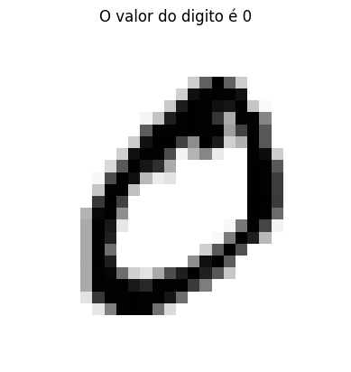
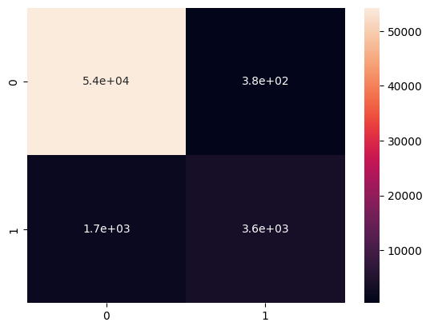
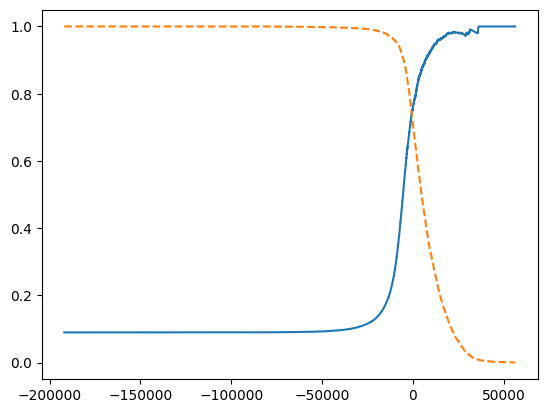
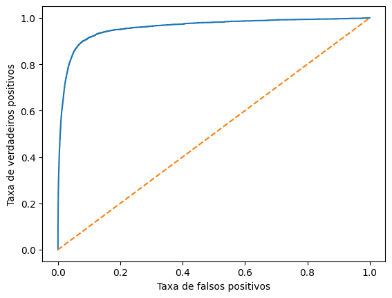
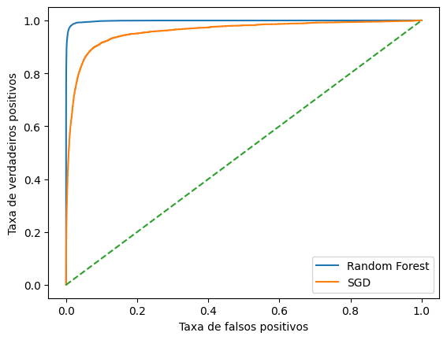
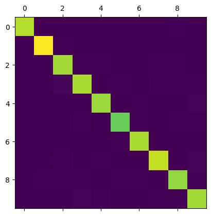
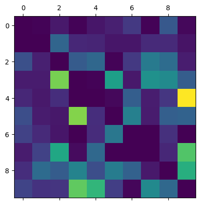

# Classificação

# MNIST

Este sera o dataset análisado, consiste em algorimos escritos a mão, o objetivo desse projeto será prever qual algorismo é este com base nos dados.


```python
from sklearn.datasets import fetch_openml
from matplotlib import pyplot as plt
import numpy as np
from sklearn.model_selection import train_test_split as tts
from sklearn.linear_model import SGDClassifier
from sklearn.model_selection import cross_val_score
from sklearn.model_selection import cross_val_predict
from sklearn.metrics import confusion_matrix
from seaborn import heatmap
from sklearn.metrics import precision_score, recall_score
from sklearn.metrics import f1_score
from sklearn.metrics import precision_recall_curve
from sklearn.metrics import roc_curve

#importando o dataset
mnist = fetch_openml("mnist_784", version=1)
mnist.keys()
```


    dict_keys(['data', 'target', 'frame', 'categories', 'feature_names', 'target_names', 'DESCR', 'details', 'url'])


```python
#Separando as variaveis independentes e a variavel dependete
X, y = mnist["data"], mnist["target"].astype(np.uint8)
X.shape
```


    (70000, 784)


Como podemos perceber, temos 70 mil observações e cada uma possui 784 características. pois são imagens de 28 x 28 pixels, como podemos visualizar pela imagem abaixo:


```python
digito = np.array(X.iloc[1])
digito_imagem = digito.reshape(28, 28)

plt.imshow(digito_imagem, cmap='binary')
plt.title(f'O valor do digito é {y[1]}')
plt.axis('off')
plt.show()
```


    

    


```python
X_train, X_test, y_train, y_test = tts(X, y, train_size = 0.857142857)
```

# Treinando um classificador binario

vamos começar simplificando o problema, classificando apenas se o númeor é um 5 ou não


```python
# Criando um vetor com true para valores iguais a 5 e false, caso contrario
y_train_5 = (y_train == 5)
y_test_5 = (y_test == 5)
```


```python
sgd_clf = SGDClassifier()
sgd_clf.fit(X_train, y_train_5)
```


<style>#sk-container-id-1 {color: black;background-color: white;}#sk-container-id-1 pre{padding: 0;}#sk-container-id-1 div.sk-toggleable {background-color: white;}#sk-container-id-1 label.sk-toggleable__label {cursor: pointer;display: block;width: 100%;margin-bottom: 0;padding: 0.3em;box-sizing: border-box;text-align: center;}#sk-container-id-1 label.sk-toggleable__label-arrow:before {content: "▸";float: left;margin-right: 0.25em;color: #696969;}#sk-container-id-1 label.sk-toggleable__label-arrow:hover:before {color: black;}#sk-container-id-1 div.sk-estimator:hover label.sk-toggleable__label-arrow:before {color: black;}#sk-container-id-1 div.sk-toggleable__content {max-height: 0;max-width: 0;overflow: hidden;text-align: left;background-color: #f0f8ff;}#sk-container-id-1 div.sk-toggleable__content pre {margin: 0.2em;color: black;border-radius: 0.25em;background-color: #f0f8ff;}#sk-container-id-1 input.sk-toggleable__control:checked~div.sk-toggleable__content {max-height: 200px;max-width: 100%;overflow: auto;}#sk-container-id-1 input.sk-toggleable__control:checked~label.sk-toggleable__label-arrow:before {content: "▾";}#sk-container-id-1 div.sk-estimator input.sk-toggleable__control:checked~label.sk-toggleable__label {background-color: #d4ebff;}#sk-container-id-1 div.sk-label input.sk-toggleable__control:checked~label.sk-toggleable__label {background-color: #d4ebff;}#sk-container-id-1 input.sk-hidden--visually {border: 0;clip: rect(1px 1px 1px 1px);clip: rect(1px, 1px, 1px, 1px);height: 1px;margin: -1px;overflow: hidden;padding: 0;position: absolute;width: 1px;}#sk-container-id-1 div.sk-estimator {font-family: monospace;background-color: #f0f8ff;border: 1px dotted black;border-radius: 0.25em;box-sizing: border-box;margin-bottom: 0.5em;}#sk-container-id-1 div.sk-estimator:hover {background-color: #d4ebff;}#sk-container-id-1 div.sk-parallel-item::after {content: "";width: 100%;border-bottom: 1px solid gray;flex-grow: 1;}#sk-container-id-1 div.sk-label:hover label.sk-toggleable__label {background-color: #d4ebff;}#sk-container-id-1 div.sk-serial::before {content: "";position: absolute;border-left: 1px solid gray;box-sizing: border-box;top: 0;bottom: 0;left: 50%;z-index: 0;}#sk-container-id-1 div.sk-serial {display: flex;flex-direction: column;align-items: center;background-color: white;padding-right: 0.2em;padding-left: 0.2em;position: relative;}#sk-container-id-1 div.sk-item {position: relative;z-index: 1;}#sk-container-id-1 div.sk-parallel {display: flex;align-items: stretch;justify-content: center;background-color: white;position: relative;}#sk-container-id-1 div.sk-item::before, #sk-container-id-1 div.sk-parallel-item::before {content: "";position: absolute;border-left: 1px solid gray;box-sizing: border-box;top: 0;bottom: 0;left: 50%;z-index: -1;}#sk-container-id-1 div.sk-parallel-item {display: flex;flex-direction: column;z-index: 1;position: relative;background-color: white;}#sk-container-id-1 div.sk-parallel-item:first-child::after {align-self: flex-end;width: 50%;}#sk-container-id-1 div.sk-parallel-item:last-child::after {align-self: flex-start;width: 50%;}#sk-container-id-1 div.sk-parallel-item:only-child::after {width: 0;}#sk-container-id-1 div.sk-dashed-wrapped {border: 1px dashed gray;margin: 0 0.4em 0.5em 0.4em;box-sizing: border-box;padding-bottom: 0.4em;background-color: white;}#sk-container-id-1 div.sk-label label {font-family: monospace;font-weight: bold;display: inline-block;line-height: 1.2em;}#sk-container-id-1 div.sk-label-container {text-align: center;}#sk-container-id-1 div.sk-container {/* jupyter's `normalize.less` sets `[hidden] { display: none; }` but bootstrap.min.css set `[hidden] { display: none !important; }` so we also need the `!important` here to be able to override the default hidden behavior on the sphinx rendered scikit-learn.org. See: https://github.com/scikit-learn/scikit-learn/issues/21755 */display: inline-block !important;position: relative;}#sk-container-id-1 div.sk-text-repr-fallback {display: none;}</style><div id="sk-container-id-1" class="sk-top-container"><div class="sk-text-repr-fallback"><pre>SGDClassifier()</pre><b>In a Jupyter environment, please rerun this cell to show the HTML representation or trust the notebook. <br />On GitHub, the HTML representation is unable to render, please try loading this page with nbviewer.org.</b></div><div class="sk-container" hidden><div class="sk-item"><div class="sk-estimator sk-toggleable"><input class="sk-toggleable__control sk-hidden--visually" id="sk-estimator-id-1" type="checkbox" checked><label for="sk-estimator-id-1" class="sk-toggleable__label sk-toggleable__label-arrow">SGDClassifier</label><div class="sk-toggleable__content"><pre>SGDClassifier()</pre></div></div></div></div></div>


# Avaliando um modelo de classificação

Existem diversas formas de avaliar um modelo de classificação e algumas serão apresentadas a seguir

## Acuracia através da validação cruzada

Para isso utilizaremos a função presente no sklearn cross_val_score(), que divide o dataset em k_folds e treina modelos para predizer


```python
cross_val_score(sgd_clf, X_train, y_train_5, cv=3, scoring="accuracy")
```


    array([0.9686    , 0.9547    , 0.96349817])


Uma acuracia minima de 94% chama atenção, mas o dataset esta desbalenceado, com 10% das amostras sendo 5, assim caso o modelo chutasse tudo como não 5, teria uma acuracia de 90%

## Matriz de Confusão

Permite que tenhamos uma melhor ideia do desempenho do programa, assim podemos verificar os falsos positivos e falsos negativos. para fazer as predições utilizaremos o cross_val_predict(), que faz a mesma coisa que o cross_val_score(), mas retorna as predições através de validação cruzada ao invés das acuracias.

Para entendermos os resultados devemos entender que os valores na horizontal são os reais e os na vertical são os previstos, sendo assim a diagonal central mostra as predições corretas, e o canto superior direito é os falsos positivos e os canto inferior direito são os falsos positivos.


```python
y_train_pred = cross_val_predict(sgd_clf, X_train, y_train_5, cv=3)
```


```python
heatmap(confusion_matrix(y_train_5, y_train_pred), annot=True)
```


    <AxesSubplot:>


    

    


A partir das matrizes de confusão podemos tirar algumas outras métricas para a análise:

- Precisão: $\frac{TP}{TP+FP}$, com TP sendo o número de verdadeiros positivos e FP o número de falsos verdadeiros. Essa métrica pode ser burlada, caso haja apenas uma medida verdadeira, e ela esteja correta. Por isso essa medida é sempre apresentada em conjunto com a revocação.

- Revocação: $\frac{TP}{TP+FN}$, com FN sendo falso negativo, isso previne o caso descrito anteriormente, pois caso ele ocorra a revocação vai ser baixa, alertando para algo errado no modelo.

O scikir-learn oferece funções para calcularmos essas metricas de forma simples, como mostrado no código abaixo:


```python
print(f'A precisão foi de {precision_score(y_train_5, y_train_pred)}')
print(f'A revocação foi de {recall_score(y_train_5, y_train_pred)}')
```

    A precisão foi de 0.9050334738408133
    A revocação foi de 0.678817184303515


Ou seja, o preditor so acerta 84% quando diz que é um 5 e so detecta 77% dos 5. O resultado ja não parece tão bom.

Para fazer essa análise é importante que você considere as duas métricas e para isso existe o F1 score, que é a média harmônica da revocação e da precisão. Essa métrica é sensivel a valores baixos, com esses impactando muito o resultado, dando vantagem a valores altos. Também beneficia valores semelhante de precisão e revocação, algo que nem sempre é benéfico.
$$ F_1 = \frac{2}{\frac{1}{precisão}+\frac{1}{revocação}}$$


```python
print(f'O f1 foi de {f1_score(y_train_5, y_train_pred)}')
```

    O f1 foi de 0.7757704569606803


## Trade-off precisão-revocação

Infelizmente, caso aumente a precisão a revocação cai, e vice versa. Isso acontece pois ele calcula um score e em uma funçao de decisão, caso esse score seja meno que o limiar ele retorna negativo e no inverso ele retorna positivo. Variando esse limiar é possivel alterar os valores de precisão e revocação. Podemos ver isso utilizando a precision_recal_curve() uma função do sklearn:


```python
#diferente dos das validações cruzadas anteriormente utilizamos o method para especificar que queremos os scores da funçao de decisão
y_scores = cross_val_predict(sgd_clf, X_train, y_train_5, cv=3, method='decision_function')

precisions, recalls, thresholds = precision_recall_curve(y_train_5, y_scores)

plt.plot(thresholds, precisions[:-1], '-', label='precisão')
plt.plot(thresholds, recalls[:-1], '--', label='revocação')
plt.show()
```


    

    


## Curva ROC

Representa a taxa de verdadeiros positivos pela taxa de falsos positivos ($1-taxa\ de\ verdadeiros\ negativos$). Portanto acurva ROC representa a _sensibilidade_(revocação) versus $1-especificidade$.

O trade-off é quanto maior a revocação, maior a taxa de falsos positivos, devido ao crescimento do threshold do modelo. Para efeito de comparação podemos utilizar a área de baixo da curva ROC, quanto maior melhor


```python
tvp, tpf, thresholds = roc_curve(y_train_5, y_scores)
plt.plot(tvp, tpf, '-', label=None)
plt.plot([0,1],[0,1], '--')
plt.xlabel("Taxa de falsos positivos")
plt.ylabel("Taxa de verdadeiros positivos")
plt.show()
```


    

    


```python
from sklearn.metrics import roc_auc_score

print(f"a área de baixo da curva é de {roc_auc_score(y_train_5, y_scores)}")
```

    a área de baixo da curva é de 0.9585670185013822


# Trinando um novo modelo

Para efeitos de comparação, vamos treinar uma RandomForest e comaparar os resultados.


```python
from sklearn.ensemble import RandomForestClassifier

forest_clf = RandomForestClassifier()
y_proba_forest = cross_val_predict(forest_clf, X_train, y_train_5, cv=3, method="predict_proba")
```


```python
y_score_forest = y_proba_forest[:,1] #score = probabilidade de ser positivo
tvp_forest, tpf_forest, thresholds_forest = roc_curve(y_train_5, y_score_forest)
plt.plot(tvp_forest, tpf_forest, "-", label="Random Forest")
plt.plot(tvp, tpf, '-', label="SGD")
plt.plot([0,1],[0,1], '--')
plt.xlabel("Taxa de falsos positivos")
plt.ylabel("Taxa de verdadeiros positivos")
plt.legend(loc="lower right")
plt.show()
```


    

    


```python
print(f"a área de baixo da curva SGD é de {roc_auc_score(y_train_5, y_scores)} e da curva da Random Forest {roc_auc_score(y_train_5, y_score_forest)}")
```

    a área de baixo da curva SGD é de 0.9585670185013822 e da curva da Random Forest 0.9982993828441921


# Classificação multiclasse

Diferente dos classficadores binarios, podemos usar outros para classificar múltiplas classes.

Alguns podem fazer isso naturalmente, mas outros são apenas classificadores binários, sendo necessário a aplicação de algumas técnicas para torna-los multiclasse. O treinamento é feito da mesma forma que os binarios.

## OVR (One vesrsus the rest)

Cria um classificador para cada classe e escolhe o maior valor de score para retornar. Esse modelo é bom para modelos com um bom escalonomento, evitando o treinamento de muitos modelos no OvO

## OvO (One versus One)

Cria um classficador para cada combinação de classes. É prefirivel utilizar quando o modelo não escala bem, pois compara grupos menores.


```python
rd_multi = RandomForestClassifier()
rd_multi.fit(X_train, y_train)
```


<style>#sk-container-id-4 {color: black;background-color: white;}#sk-container-id-4 pre{padding: 0;}#sk-container-id-4 div.sk-toggleable {background-color: white;}#sk-container-id-4 label.sk-toggleable__label {cursor: pointer;display: block;width: 100%;margin-bottom: 0;padding: 0.3em;box-sizing: border-box;text-align: center;}#sk-container-id-4 label.sk-toggleable__label-arrow:before {content: "▸";float: left;margin-right: 0.25em;color: #696969;}#sk-container-id-4 label.sk-toggleable__label-arrow:hover:before {color: black;}#sk-container-id-4 div.sk-estimator:hover label.sk-toggleable__label-arrow:before {color: black;}#sk-container-id-4 div.sk-toggleable__content {max-height: 0;max-width: 0;overflow: hidden;text-align: left;background-color: #f0f8ff;}#sk-container-id-4 div.sk-toggleable__content pre {margin: 0.2em;color: black;border-radius: 0.25em;background-color: #f0f8ff;}#sk-container-id-4 input.sk-toggleable__control:checked~div.sk-toggleable__content {max-height: 200px;max-width: 100%;overflow: auto;}#sk-container-id-4 input.sk-toggleable__control:checked~label.sk-toggleable__label-arrow:before {content: "▾";}#sk-container-id-4 div.sk-estimator input.sk-toggleable__control:checked~label.sk-toggleable__label {background-color: #d4ebff;}#sk-container-id-4 div.sk-label input.sk-toggleable__control:checked~label.sk-toggleable__label {background-color: #d4ebff;}#sk-container-id-4 input.sk-hidden--visually {border: 0;clip: rect(1px 1px 1px 1px);clip: rect(1px, 1px, 1px, 1px);height: 1px;margin: -1px;overflow: hidden;padding: 0;position: absolute;width: 1px;}#sk-container-id-4 div.sk-estimator {font-family: monospace;background-color: #f0f8ff;border: 1px dotted black;border-radius: 0.25em;box-sizing: border-box;margin-bottom: 0.5em;}#sk-container-id-4 div.sk-estimator:hover {background-color: #d4ebff;}#sk-container-id-4 div.sk-parallel-item::after {content: "";width: 100%;border-bottom: 1px solid gray;flex-grow: 1;}#sk-container-id-4 div.sk-label:hover label.sk-toggleable__label {background-color: #d4ebff;}#sk-container-id-4 div.sk-serial::before {content: "";position: absolute;border-left: 1px solid gray;box-sizing: border-box;top: 0;bottom: 0;left: 50%;z-index: 0;}#sk-container-id-4 div.sk-serial {display: flex;flex-direction: column;align-items: center;background-color: white;padding-right: 0.2em;padding-left: 0.2em;position: relative;}#sk-container-id-4 div.sk-item {position: relative;z-index: 1;}#sk-container-id-4 div.sk-parallel {display: flex;align-items: stretch;justify-content: center;background-color: white;position: relative;}#sk-container-id-4 div.sk-item::before, #sk-container-id-4 div.sk-parallel-item::before {content: "";position: absolute;border-left: 1px solid gray;box-sizing: border-box;top: 0;bottom: 0;left: 50%;z-index: -1;}#sk-container-id-4 div.sk-parallel-item {display: flex;flex-direction: column;z-index: 1;position: relative;background-color: white;}#sk-container-id-4 div.sk-parallel-item:first-child::after {align-self: flex-end;width: 50%;}#sk-container-id-4 div.sk-parallel-item:last-child::after {align-self: flex-start;width: 50%;}#sk-container-id-4 div.sk-parallel-item:only-child::after {width: 0;}#sk-container-id-4 div.sk-dashed-wrapped {border: 1px dashed gray;margin: 0 0.4em 0.5em 0.4em;box-sizing: border-box;padding-bottom: 0.4em;background-color: white;}#sk-container-id-4 div.sk-label label {font-family: monospace;font-weight: bold;display: inline-block;line-height: 1.2em;}#sk-container-id-4 div.sk-label-container {text-align: center;}#sk-container-id-4 div.sk-container {/* jupyter's `normalize.less` sets `[hidden] { display: none; }` but bootstrap.min.css set `[hidden] { display: none !important; }` so we also need the `!important` here to be able to override the default hidden behavior on the sphinx rendered scikit-learn.org. See: https://github.com/scikit-learn/scikit-learn/issues/21755 */display: inline-block !important;position: relative;}#sk-container-id-4 div.sk-text-repr-fallback {display: none;}</style><div id="sk-container-id-4" class="sk-top-container"><div class="sk-text-repr-fallback"><pre>RandomForestClassifier()</pre><b>In a Jupyter environment, please rerun this cell to show the HTML representation or trust the notebook. <br />On GitHub, the HTML representation is unable to render, please try loading this page with nbviewer.org.</b></div><div class="sk-container" hidden><div class="sk-item"><div class="sk-estimator sk-toggleable"><input class="sk-toggleable__control sk-hidden--visually" id="sk-estimator-id-4" type="checkbox" checked><label for="sk-estimator-id-4" class="sk-toggleable__label sk-toggleable__label-arrow">RandomForestClassifier</label><div class="sk-toggleable__content"><pre>RandomForestClassifier()</pre></div></div></div></div></div>


```python
rd_multi.predict([digito])
```

    /home/rafa/.local/lib/python3.10/site-packages/sklearn/base.py:450: UserWarning: X does not have valid feature names, but RandomForestClassifier was fitted with feature names
      warnings.warn(


    array([0], dtype=uint8)


```python
rd_multi.predict_proba([digito])
```

    /home/rafa/.local/lib/python3.10/site-packages/sklearn/base.py:450: UserWarning: X does not have valid feature names, but RandomForestClassifier was fitted with feature names
      warnings.warn(


    array([[0.99, 0.  , 0.  , 0.  , 0.  , 0.01, 0.  , 0.  , 0.  , 0.  ]])


## Analisando o erro

Podemos utilizar a matriz de confusão para análisar o erro, mas isso acaba gerando muitos números e gerando confusão na hora da finalização. Para se ter uma melhor visualização podemos zerar a coluna central e dividir cada valor pela quantidade de observações da classe, evitando que classes com mais observações sejam prejudicadas.


```python
y_train_pred_multi = cross_val_predict(rd_multi, X_train, y_train, cv=3)
```


```python
conf_mat = confusion_matrix(y_train, y_train_pred_multi)
plt.matshow(conf_mat)
```


    <matplotlib.image.AxesImage at 0x7fbf90990bb0>


    

    


```python
row_sum = conf_mat.sum(axis=1, keepdims=True)
norm_conf_mat = conf_mat/row_sum
```


```python
np.fill_diagonal(norm_conf_mat, 0)
plt.matshow(norm_conf_mat)
```


    <matplotlib.image.AxesImage at 0x7fbf909d9f90>


    

    

